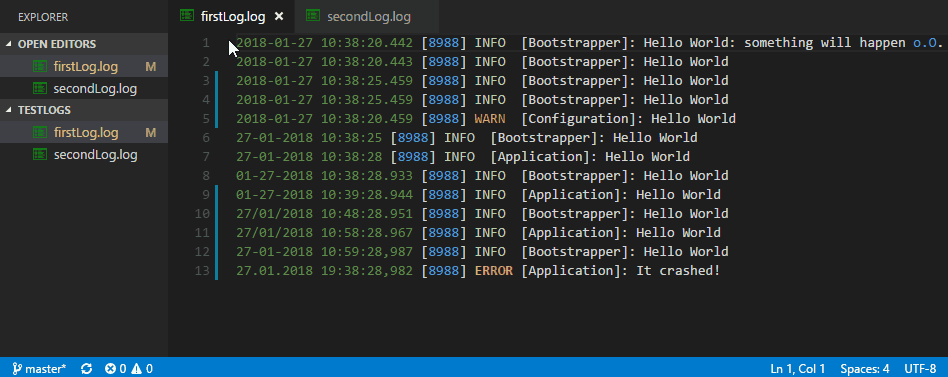

# Log File Highlighter

[](https://raw.githubusercontent.com/emilast/vscode-logfile-highlighter/master/LICENSE) [](https://marketplace.visualstudio.com/items?itemName=emilast.LogFileHighlighter) [](https://travis-ci.org/emilast/vscode-logfile-highlighter) [](https://marketplace.visualstudio.com/items?itemName=emilast.LogFileHighlighter) [](https://marketplace.visualstudio.com/items?itemName=emilast.LogFileHighlighter)


![alt text][sample]

## Description
A Visual Studio Code extension for adding color highlighting to log files. It is based on standard conventions for log4net log files but it's general enough to be useful for other variations of log files as well. The colors are customizable but by default the current color theme's colors are used.

**Note**
An earlier version of the syntax highlighting definition from this extension was included into Visual Studio Code [version 1.20](https://code.visualstudio.com/updates/v1_20#_output-panel). If the default behavior of log files in VS Code is good enough for you, then you don't need this extension. However, if you want additional highlighting, customizable patterns and time duration calculation, then keep reading :-)

## Features
### Syntax Highlighting
The extension associates with `.log` files and applies coloring to the different elements in the file, for example:

* Dates and times in ISO format, such as
    * `2015-12-09`
    * `2015-12-09 09:29`
    * `2015-12-09 09:29:02.258`
* Dates and times in some culture specific formats
    * `12/09/2016`
    * `12.09.2016`
    * `12-09-2016`
    * `12-09-2015 09:29`
    * `12-09-2015 09:29:02,258`
* Log level, such as
    * `DEBUG`
    * `INFO`, `INFORMATION`
    * `WARN`, `WARNING`
    * `ERROR`, `FAIL`, `FAILURE`
* Numeric constants, such as
    * `1`
    * `234`
* Standard .Net constants
    * `null`
    * `true`
    * `false`
* String constants, enclosed in single or double quotes. Examples:
    * `"lorem ipsum"`
    * `'lorem ipsum'`
* GUIDs. Example:
    * `859A4209-A82D-4CA1-8468-C2606A3501EE`
* .Net exception type names, i.e. word ending with `Exception`, such as
    * `ArgumentNullException`
    * `HttpException`
* .Net exception stack traces, i.e. lines starting with whitespace characters, followed by `at`, for example:
    ```
    System.NullReferenceException: Object reference not set to an instance of an object.
        at MyClass.DoSomethingElse(string foo)
        at MyClass.DoSomething()
    ```
* Urls:
    * `http://www.meadow.se/wordpress/`
* File Paths (`/` as well as `\` as seperator):
    * `C:/foo/bar.txt`
    * `../../foo/bar.txt`
    * `./foo/bar.txt`
    * `//foo/bar.txt`
* Namespaces (sequences of alphanumeric and dot characters). Useful to identity namespace qualified type names, for example.
    * `MyApp.MyNameSpace.MyClass`

### Visualization of Time Duration
If you select multiple lines of a `.log` file,
a status bar item is displayed that indicates how many days, hours, minutes, seconds and milliseconds you have selected.
  

## Customization

### Customizing the colors

By default, this extension reuses existing theme colors in order to adapt to the user's preferences. Sometimes this will result in colors that may not make complete sense in the log file context (for example `ERROR` might be green and `DEBUG` red, when it would be more appropriate to have it the other way around).

For this reason, the extension defines a special set of grammar tokens that can be used to override the colors of the default log items:

```
log.constant
log.date
log.debug
log.error
log.exception
log.info
log.string
log.exceptiontype
log.warning
```

To override the color for one of these, use the `editor.tokenColorCustomizations` user setting, which was introduced in Visual Studio Code 1.15. Here's an example that forces errors to be red and bold and warnings to be orange, regardless of what color theme is used:

```JSON
"editor.tokenColorCustomizations": {
    "textMateRules": [
        {
            "scope": "log.error",
            "settings": {
                "foreground": "#af1f1f",
                "fontStyle": "bold"
            }
        },
        {
            "scope": "log.warning",
            "settings": {
                "foreground": "#f4ad42",
                "fontStyle": ""
            }
        }
    ]
}
```

### Defining custom highlighting patterns

The extension also supports defining custom patterns to be highlighted. This can be useful to make the extension compatible with the log levels of an otherwise unsupported logging framework or to highlight domain specific patterns, or just about anything else.

The patterns are defined in the user settings like in this example:


```JSON
"logFileHighlighter.customPatterns": [
    {
        "pattern": "Verbose",
        "foreground": "green"
    },
    {
        "pattern": "E/\\w+",
        "foreground": "#af1f1f"
    }
]
```

* `pattern` - The matching expression. This can be either a string constant or a JavaScript regular expression (remember to **escape special characters**).

* `foreground` - The color to use as foreground color for the matched pattern. Use hex colors or predefined VS Code colors.

  

### File associations

To make VS Code treat other file extensions than the default `.log` as log files, add the following to the user settings:

```JSON
"files.associations": {
    "*.log.*": "log"
},
```
The example above associates extensions such as `.log.1` and `.log.2` with the Log File highlighter extension.


[sample]: https://raw.githubusercontent.com/emilast/vscode-logfile-highlighter/master/content/sample.png
